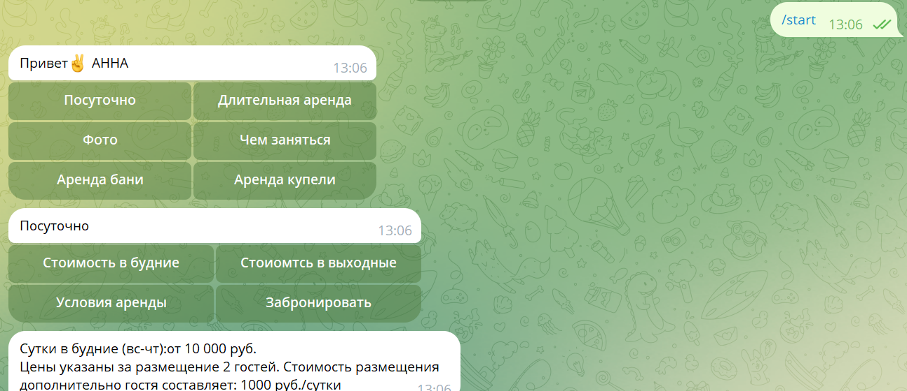
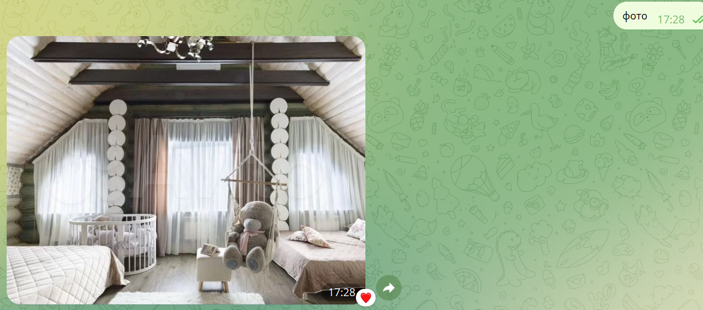
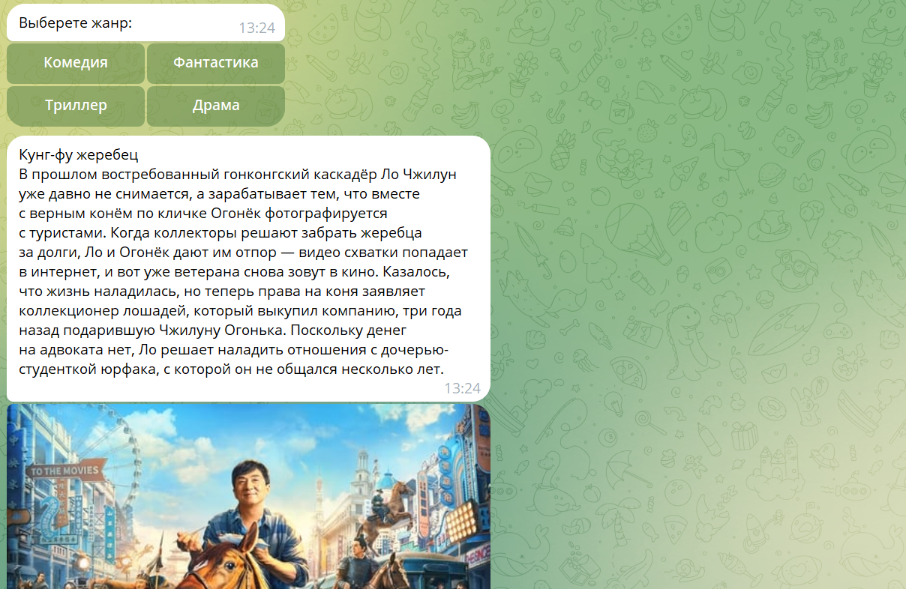

<h1 align="center">Телеграм-бот для посуточной аренды коттеджа</h1>
<h2 align="center">

## Это чат-бот для посуточной аренды коттеджа GorchakovoEco_House
## В нем можно:
### - Узнать информацию о стоимости и предоставляемых услугах

### - Получить контакты для бронирования
### - Получить фотографии коттеджа

### - Востпользоваться услугой "Летний кионтеатр", которая позволяет выбрать фильм для просмотра на открытой веранде, а также сохраняет историю просмотров

### - Узнать правила проживания в доме

## Все версии библиотек хранятся в файле requirements.txt,  установить  зависимости можно с помощью команды(pip install -r requirements.txt) 
## В проекте используется API: https://kinopoisk.dev/

##  1. Models.py
### 1.1.подключаемся к базе данных my_database.db
### 1.2.создаём модель Hystory c атрибутами:
##### 1.2.1. id, IntegerField -- целое число
##### 1.2.2.имя пользователя, CharField -- строка
##### 1.2.3. название фильма, CharField -- строка
### 1.3. во внутреннем классе Meta указываем нашу базу данных
### создаём таблицу users в базе данных

##  2. Commands.py
### 2.1. Функция fulfill_date имеет параметры:
### база данных, модель, иформация по столбцам в виде list
### Резузальтат выполнения: заполнение модели переданными данными
### 2.2.Функция retrieve_all_data меет параметры:
### база данных, модель, иформация по столбцам

##  3. req_kino.py
### 2.1. Функция get_info имеет параметры:
### type_of_film: str
### Резузальтат выполнения: информация с кинопоиска в виде list

##  4. main
### 4.1.  Функция get_token имеет параметр :key - название необходимого токена. 
### Возвращает токен с переданным именем.
### 4.2. Функция film_info имеет параметры:
### call, res 
### Резузальтат выполнения:ответ пользователю в виде запрашиваемой информации,  заполнение модели переданными данными
### 4.3.Функция start_message меет параметр:message
### Резузальтат выполнения: приветсовование пользователя
### 4.4.Функция get_use_text меет параметр:message
### Резузальтат выполнения: ответ пользователю
### 4.5.Функция bottom_menu 
### Резузальтат выполнения: ответ пользователю на нажатие одной из кнопок в телеграм
### 4.6.Функция callback меет параметр: call
### Резузальтат выполнения: ответ пользователю на нажатие одной из кнопок в телеграм
